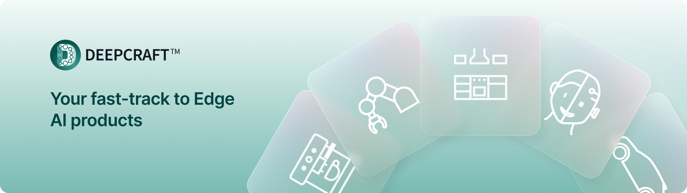

# DEEPCRAFT™ Studio Public Unit Library

**DEEPCRAFT™ Studio** (formerly Imagimob Studio) is an end-to-end platform for developing AI / Machine Learning (ML) models for the edge. The platform is designed to support users in creating robust and high-quality models that are ready for deployment in commercial products.

---

## 📖 Overview

This repository contains the unit library from the node explorer pulled from **DEEPCRAFT™ Studio**. For the best experience, we recommend accessing these units directly through the [DEEPCRAFT™ Studio platform](https://www.imagimob.com/studio).

---

## 🚀 Usage

These units are designed to be seamlessly integrated with **DEEPCRAFT™ Studio**. To get started, access them directly via the platform at [https://www.imagimob.com/studio](https://www.imagimob.com/studio).

---

## 🤝 Contribution

We welcome contributions from all users! New units can be submitted, subject to the **DEEPCRAFT™ review process**. You can read more about this under the **Contributing** tab. To learn how to create your own unit, check out the resources in the **tutorial folder**. 

---

## 📝 Submission Process

To submit a unit:

1. **Fork** this repository.
2. Add your unit to an appropriate folder.
3. Create a **pull request** for review by a DEEPCRAFT™ developer.

> **Important**: All unit submissions must include a `README` file with a detailed **use-case description**.

---

## 📜 License

This project is licensed under the **MIT License**.

