# DEEPCRAFT™ Studio: Creating Custom Units

This tutorial guides you through the process of creating custom units in **DEEPCRAFT™ Studio**, covering both Native Units (C-based) and Graph Units (composite units built using other units).

---

## 1. Create a Graph Project

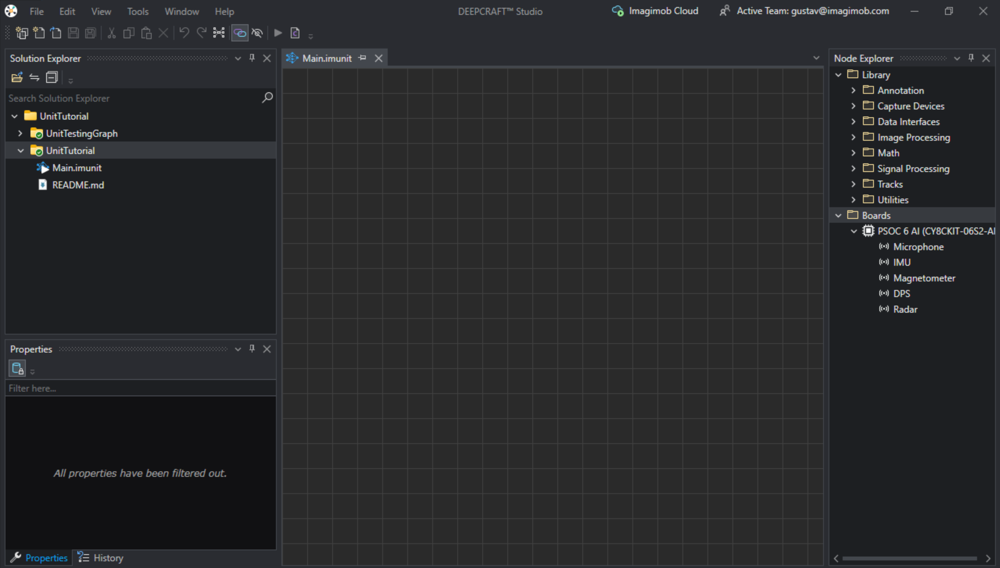

To create a project, follow this guide: [Graph UX Getting Started](https://developer.imagimob.com/getting-started/graph-ux).  
For more general information on the graph, read this article: [Graph UX Overview](https://developer.imagimob.com/getting-started/graph-ux/graph-ux-overview).

---

## 2. Create a Unit

Create either a **Native Unit** (C-based) or a **Graph Unit** (composite units built using other units).

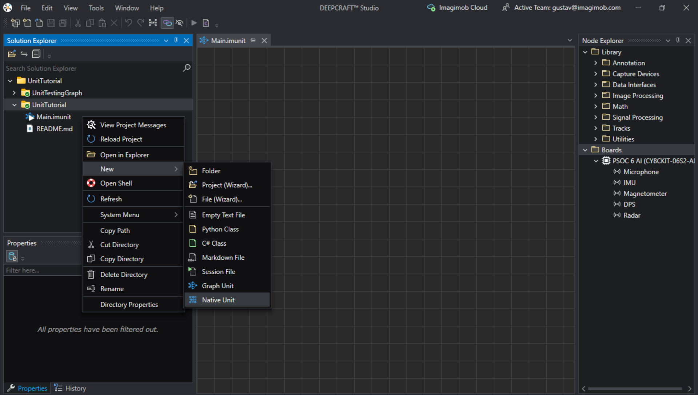

---

## 3. Creating a Native Unit

In this tutorial, we will create a Native Unit that adds an integer to the input signal.

### 3.1 Name the Native Unit

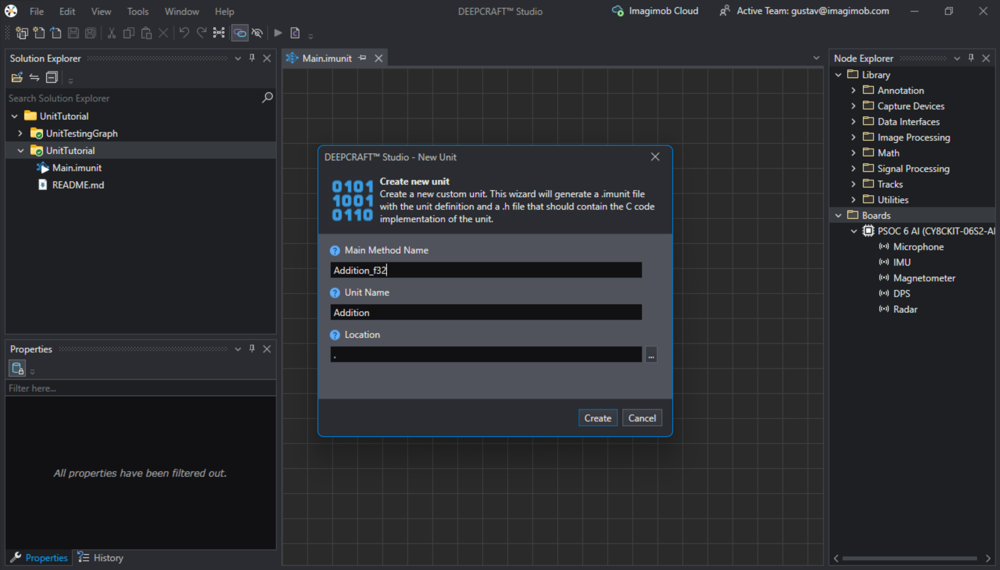

### 3.2 Understanding the `.imunit` File

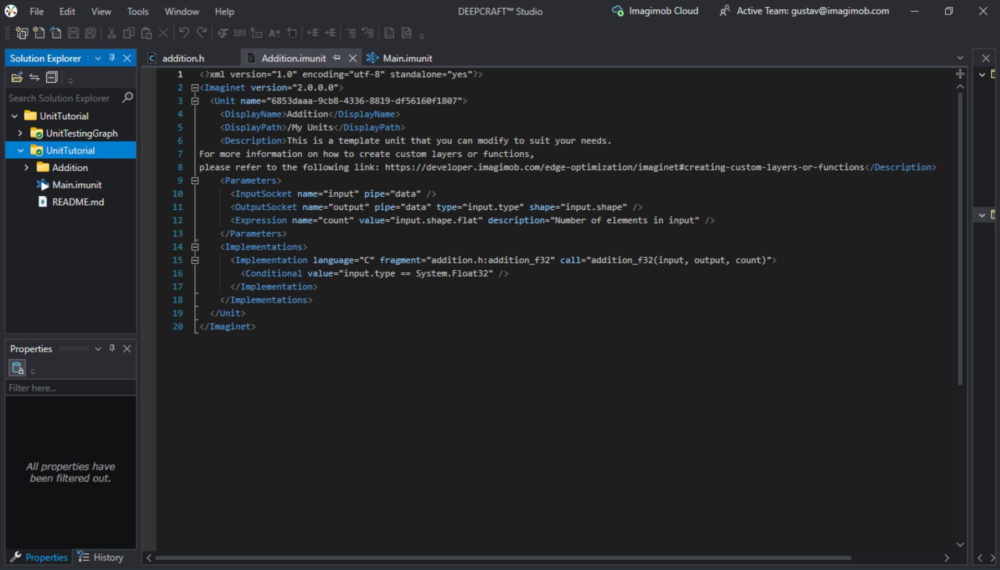

The `.imunit` file defines the node interface in the graph. Here, you can:
- Add new input parameters
- Set output shapes
- Configure the sampling rate

This file also calls the C code that handles computations on the input signal. The image above shows the default `.imunit` file after creating a unit.

### 3.3 Understanding the `.h` File

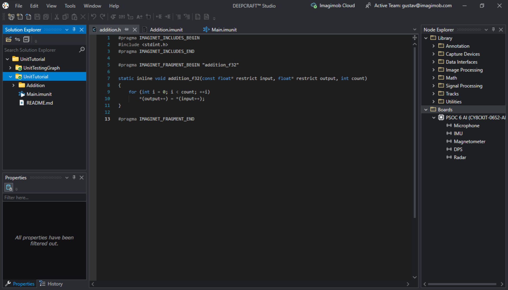

The `.h` file contains the C code called by the `.imunit` file. Key guidelines:
- Place code between `#pragma IMAGINET_FRAGMENT_BEGIN` and `#pragma IMAGINET_FRAGMENT_END`.
- Add new libraries between `#pragma IMAGINET_INCLUDES_BEGIN` and `#pragma IMAGINET_INCLUDES_END`.
- Do **not** place code or comments outside of `#pragma` sections.

The image above shows the default `.h` file after creating a unit.

### 3.4 Drag Unit to Graph

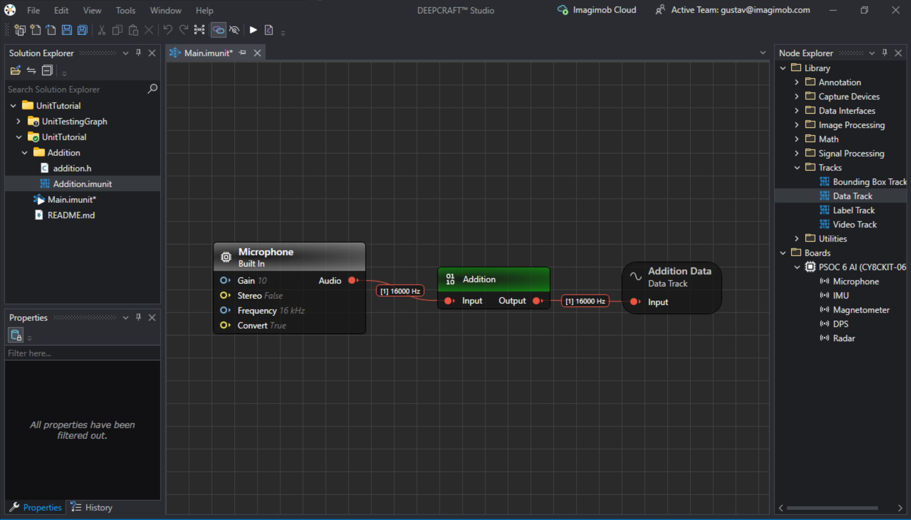

1. Open the Graph-UX project containing the unit.
2. Drag and drop the `.imunit` file from the unit folder into the Graph.
3. Add a capture device and a data track to the graph, then attach them to the unit.

### 3.5 Adding Input Parameters to the Unit

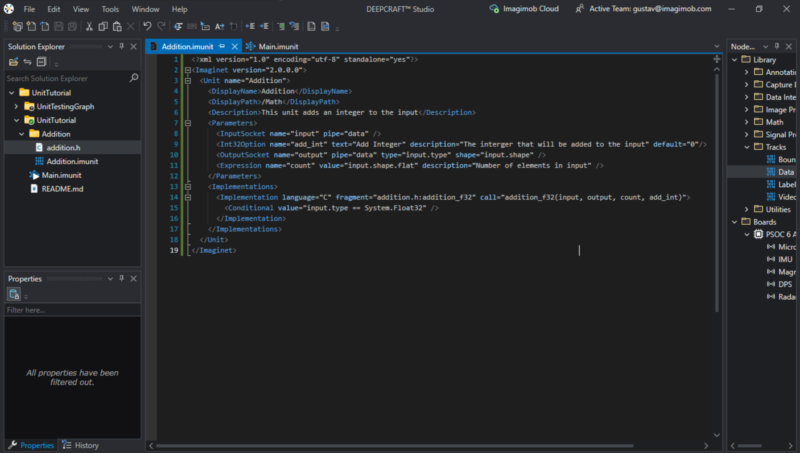

To add an input parameter (an integer to add to the input signal):
1. Add `Int32Option` within the parameter brackets, naming it `add_int` (see line 9 in the image).
2. Include the `add_int` variable in the C code function call (see line 14 in the image).

For in-depth documentation on `.imunit` syntax, read this article: [Custom Layers and Functions](https://developer.imagimob.com/deployment/custom-layers-functions).

### 3.6 Adding the Addition Logic to the `.h` File

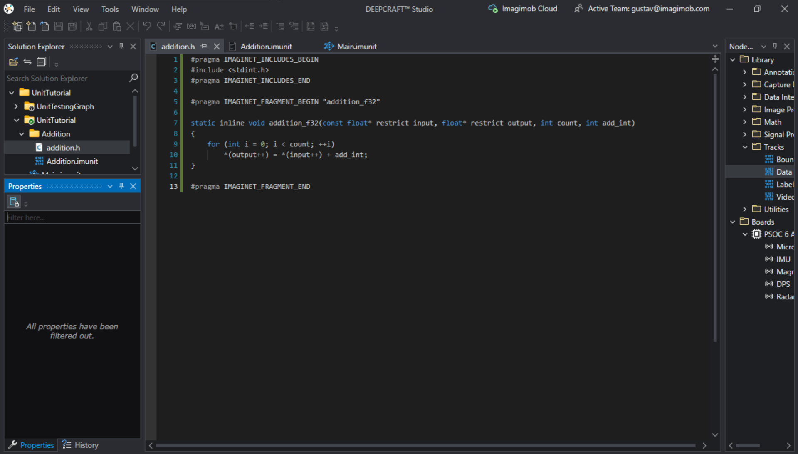

1. Add the `add_int` variable to the input parameters.
2. Add the `add_int` variable to the input signal and store the result in the output variable.

### 3.7 Testing the Unit

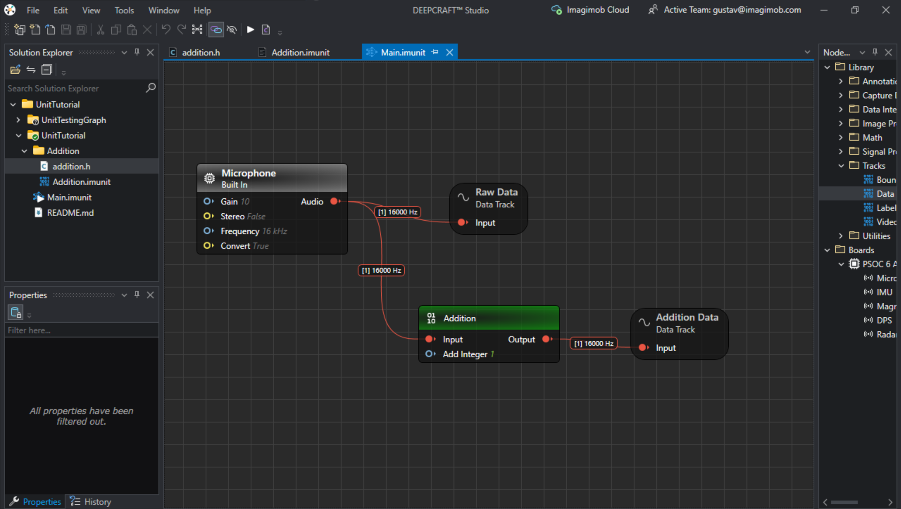

To test the unit:
1. Add another data track directly connected to the capture device to compare the altered signal with the unaltered signal.
2. Choose the integer to add to the input signal.
3. Press the play button.

### 3.8 Unit Demo

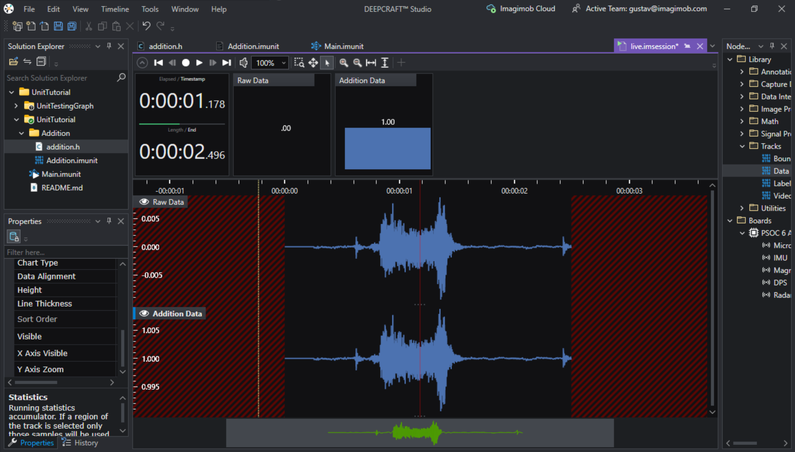

The unaltered input signal is centered around 0, while the altered signal is centered around 1, confirming that the custom unit works as intended.

**Your Native Unit is now complete!**

---

## 4. Creating Graph Units

### 4.1 Create a Graph Unit

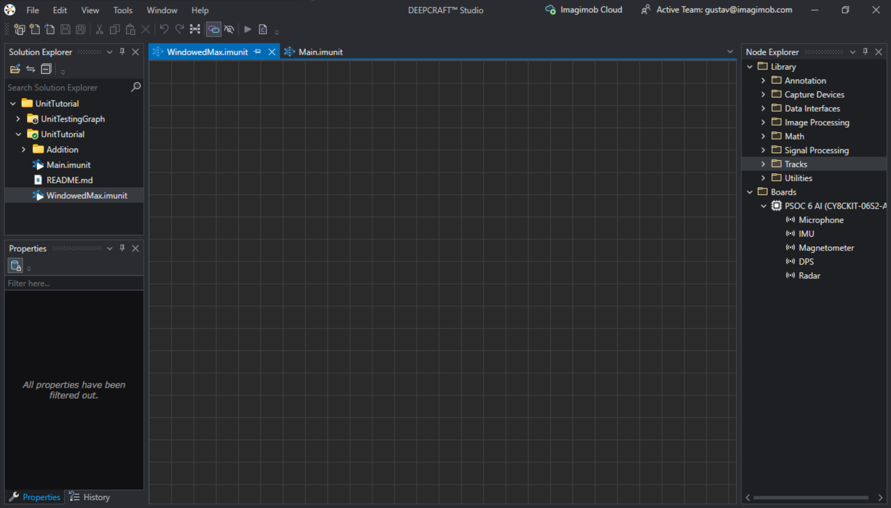

When a Graph Unit is created, a new graph is opened. The unit's logic is built entirely using units from the Node Explorer. In this tutorial, we will create a **windowed max function** that fetches the maximum value in a slice of time.

### 4.2 Add Input and Output Nodes

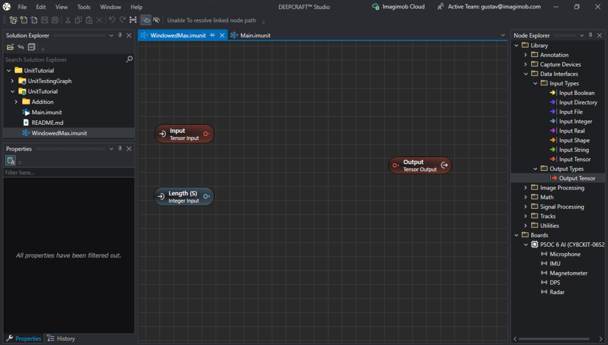

1. Add an **Input Tensor** node from the Node Explorer (under the *Data Interfaces* folder) for the incoming tensor signal.
2. Add an **Output Tensor** node for the outgoing tensor signal.
3. Add an **Input Real** node to specify the window length.
4. Name these nodes appropriately.

### 4.3 Add Logic

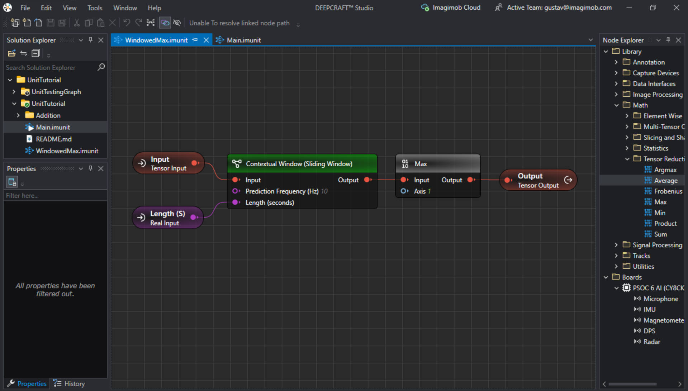

To implement the logic:
1. Add a **Contextual Window (Sliding Window)** node from the *Signal Processing/Time Domain* folder.
2. Connect the input signal and the window length input node to the Contextual Window.
3. Add a **Max** node from the *Math/Tensor Reductions* folder to fetch the maximum value from the data samples.
4. Connect the Max node to the output node.

### 4.4 Drag `.imunit` File to Graph

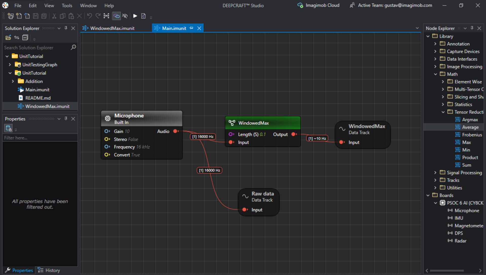

1. Open the Graph-UX project containing the unit.
2. Drag and drop the `.imunit` file into the Graph.
3. Add a capture device and a data track, then attach them to the unit.
4. Add another data track connected directly to the capture device to compare the altered and unaltered signals.
5. Press the play button.

### 4.5 Test the Graph Unit

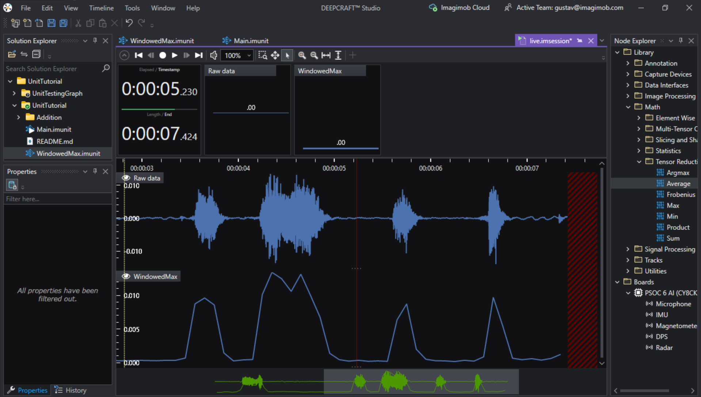

Test the unit's output. The unit appears to work as intended.

**Your Graph Unit is now complete!**